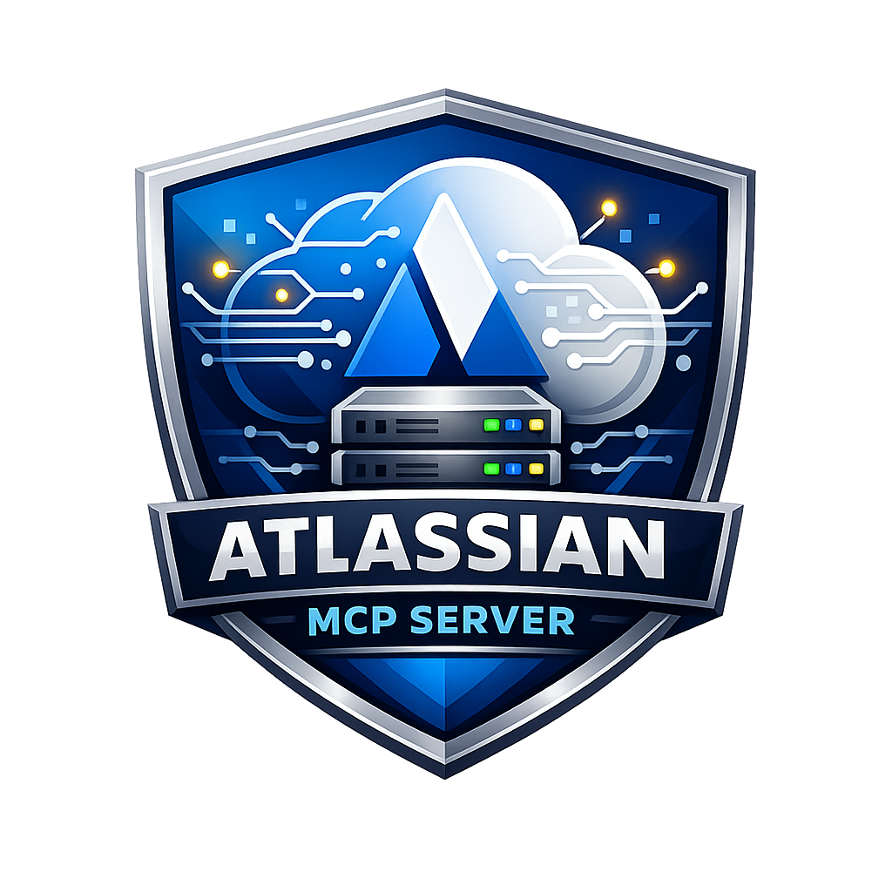

  

# Atlassian Private MCP Server — VS Code Extension

VS Code extension that registers the Atlassian Private MCP Server, making all 24 tools available to GitHub Copilot and other AI assistants.

## Installation

Search for "Atlassian Private MCP Server" in the VS Code marketplace, or install the VSIX from releases.

## Configuration

Open **Settings** → search "Atlassian Private MCP":

| Setting | Description |
|---------|-------------|
| `jiraBaseUrl` | Your Jira Data Center base URL |
| `jiraAuthType` | `pat` (recommended) or `basic` |
| `jiraPat` | Jira Personal Access Token |
| `jiraUsername` | Jira username (basic auth only) |
| `jiraPassword` | Jira password (basic auth only) |
| `confluenceBaseUrl` | Your Confluence Server/DC base URL |
| `confluenceAuthType` | `pat` (recommended) or `basic` |
| `confluencePat` | Confluence Personal Access Token |
| `confluenceUsername` | Confluence username (basic auth only) |
| `confluencePassword` | Confluence password (basic auth only) |
| `tlsRejectUnauthorized` | Disable for self-signed certs |

## Usage

After installation and configuration:

1. The server appears in VS Code's **MCP Servers** panel
2. Click **Start** to activate the server
3. Use **Show Output** to view server logs
4. All 24 Atlassian tools appear in Copilot Chat's tool picker

### Example Prompts for Copilot Chat

Try these prompts in GitHub Copilot Chat (with the Atlassian MCP server started):

- **"Get the details of PROJ-123"** → fetches full issue including status, assignee, description
- **"Search for open bugs assigned to me in the PLATFORM project"** → JQL search
- **"Create a Bug in INFRA: 'Login page returns 500 after deploy'"** → creates issue
- **"Transition PROJ-456 to Done"** → performs workflow transition
- **"Add a comment to PROJ-789 saying the fix is in production"** → adds comment
- **"List all Confluence spaces"** → fetches space directory
- **"Get the content of page 12345"** → fetches page body
- **"Search Confluence for 'deployment runbook' in the DEVOPS space"** → CQL search
- **"Create a page in TEAM space titled 'Sprint 42 Retro'"** → creates page
- **"Who am I logged in as?"** → shows authenticated user info

## Requirements

- VS Code **1.99.0** or later (MCP API support)
- Network access to your Jira/Confluence instances
- Valid Personal Access Token or Basic Auth credentials

## Troubleshooting

- **Server not visible**: Ensure VS Code >= 1.99.0 and reload the window
- **Authentication errors**: Verify your PAT or username/password in Settings
- **TLS errors**: Set `tlsRejectUnauthorized` to false for self-signed certificates
- **No server registered**: At least one base URL (Jira or Confluence) must be configured

## Tools (24 total)

### Jira (15)
| Tool | Description |
|------|-------------|
| `getJiraIssue` | Get issue by key/ID |
| `searchJiraIssuesUsingJql` | Search with JQL |
| `createJiraIssue` | Create new issue |
| `editJiraIssue` | Update issue fields |
| `transitionJiraIssue` | Workflow transitions |
| `addCommentToJiraIssue` | Add a comment |
| `addWorklogToJiraIssue` | Log time |
| `createIssueLink` | Link two issues |
| `getTransitionsForJiraIssue` | List transitions |
| `getVisibleJiraProjects` | List projects |
| `getJiraProjectIssueTypesMetadata` | Issue types in project |
| `getJiraIssueTypeMetaWithFields` | Create-field metadata |
| `getIssueLinkTypes` | Link type names |
| `getJiraIssueRemoteIssueLinks` | Remote links |
| `lookupJiraAccountId` | Find users |

### Confluence (7 Read + 4 Write + 1 Search)
| Tool | Description |
|------|-------------|
| `getConfluencePage` | Get page by ID |
| `searchConfluenceUsingCql` | Search with CQL |
| `createConfluencePage` | Create new page |
| `updateConfluencePage` | Update page |
| `getConfluencePageDescendants` | Child pages |
| `getConfluenceSpaces` | List spaces |
| `getPagesInConfluenceSpace` | Pages in space |
| `getConfluencePageFooterComments` | Footer comments |
| `getConfluencePageInlineComments` | Inline comments |
| `getConfluenceCommentChildren` | Comment replies |
| `createConfluenceFooterComment` | Add footer comment |
| `createConfluenceInlineComment` | Add inline comment |

### Common (2)
| Tool | Description |
|------|-------------|
| `atlassianUserInfo` | Authenticated user info |
| `fetch` | Generic REST call (SSRF-protected) |
